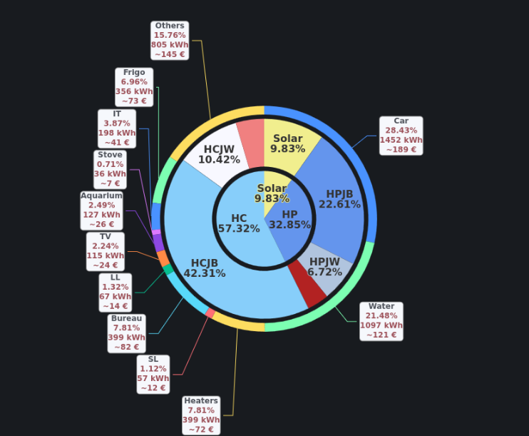

= Mathematics
:hardbreaks:

[IMPORTANT]
====
Pre-requisits for Mathematics:

- Database with enough data points: Prometheus
- (optional) Graphic Interface to visualize queries: Grafana
====

== Optimization

Below examples uses mathematics on electricity data points.

.What we own:
* 365+ days of electricity consumption measures: Power (W) and Energy (kWh)
* Energy measures are categorized with Enedis *Tempo* costs (France contract with variable costs):
** Blue: ~300 days of low costs
** White: ~42 days of mid costs
** Red: ~22 days of low costs
** Blue/White/Red costs are divided into High/Low hours, with High hours between 6am and 10pm (16h)
* Solar Energy measures:
** Solar Panel Total production
*** Auto-consumption by house
*** Energy sent to the grid
* Some high consumer measures:
** Car
** Water heater
** Electric heaters
** Fridge
** Computers

.Questions we can have:
* Is *Tempo* the good contract for our consumption?
** Many other contracts exists, starting from *Base* (same cost all the time), *HC/HP* (same low/high costs all days of years), *ZenFlex*, *ZenFix*, etc
* What happens if contract hours change? (some low cost hours might move in mid-day when sun is high)

.Question - predictions:
* What happens if adding more solar during the day, aka Tempo high costs? 
** Evolution of consumption might show that previously best contract might no longer be accurate one to pick
* What would happen if we move some consumption?
** Water heater, Car could be moved?

.Questions - optional
* Yearly, when do comsumption occurs?
* Weekly, when do consumption occurs?
* Daily, when do consumption occurs?
* All above can be visualized using graphs

=== Setting the facts

[TIP]
====
Visualizing the facts provide a great understanding.
====

.Example rendering of 365 days of consumption:

Above, a minimalist donut graph was chosen for example.

Here is how to gather the facts from datapoints:

.Metrics definition
[cols="1,1,2"]
|===

|Metric
|Description
|Formula

|Solar Total| Solar Energy Total         | opendtu_YieldTotal{type="AC"}[1h]

|Grid In    | Energy Consumed from Grid  | zigbee_energy_b{location="Garage~PowerMeter"}[1h]
|Grid Out   | Energy Produced to Grid    | zigbee_energy_produced_b{location="Garage~PowerMeter"}[1h]

|HP Red     | Red High Cost Day Energy   | teleinfo_BBRHPJR{location="main"}[1h]
|HC Red     | Red Low Cost Day Energy    | teleinfo_BBRHCJR{location="main"}[1h]

|HP White   | White High Cost Day Energy | teleinfo_BBRHPJW{location="main"}[1h]
|HC White   | White Low Cost Day Energy  | teleinfo_BBRHCJW{location="main"}[1h]

|HP Blue    | Blue High Cost Day Energy  | teleinfo_BBRHPJB{location="main"}[1h]
|HC Blue    | Blue Low Cost Day Energy   | teleinfo_BBRHCJB{location="main"}[1h]

|===

[TIP]
====
If measures are correct, then Solar auto-consumed:

Solar            = Solar Total - Grid Out
Home Consumption = Grid In + Solar
Grid In          = sum(HP/HC Blue/White/Red)
====

.Computing yearly consumptions via increase
.Metrics definition
[cols="1,3"]
|===

|Metric
|Formula
|Value

|Solar Total| increase(opendtu_YieldTotal{type="AC"}[365d])                                 | 840 kWh

|Grid In    | increase(zigbee_energy_b{location="Garage~PowerMeter"}[365d])                 | 5050 kWh
|Grid Out   | increase(zigbee_energy_produced_b{location="C03~Garage~PowerMeter"}[365d])    | 280 kWh

|HP Red     | increase(teleinfo_BBRHPJR{}[365d]) / 1000                                     | 185 kWh
|HC Red     | increase(teleinfo_BBRHCJR{}[365d]) / 1000                                     | 233 kWh

|HP White   | increase(teleinfo_BBRHPJW{}[365d]) / 1000                                     | 375 kWh
|HC White   | increase(teleinfo_BBRHCJW{}[365d]) / 1000                                     | 552 kWh

|HP Blue    | increase(teleinfo_BBRHPJB{}[365d]) / 1000                                     | 1 277 kWh
|HC Blue    | increase(teleinfo_BBRHCJB{}[365d]) / 1000                                     | 2 429 kWh

|===

